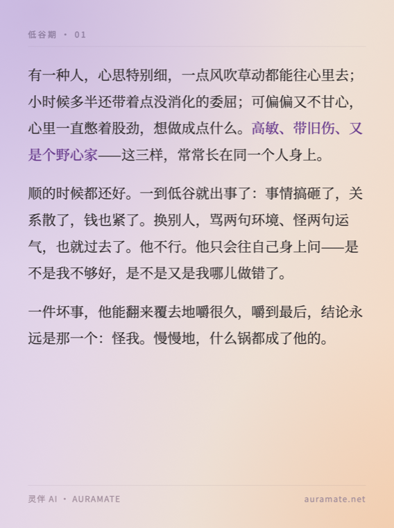
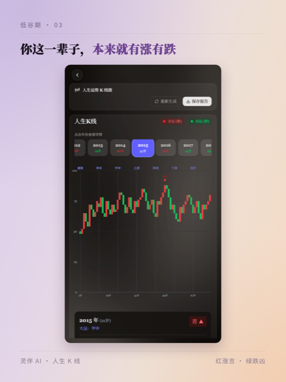
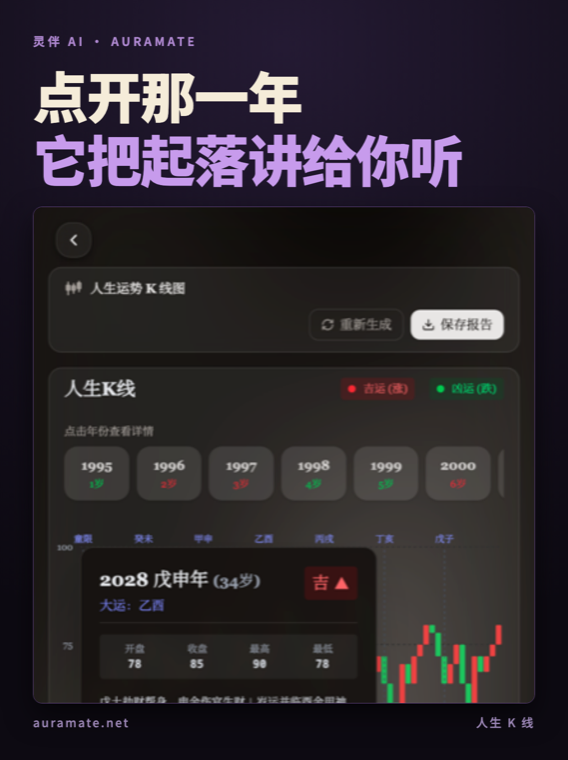
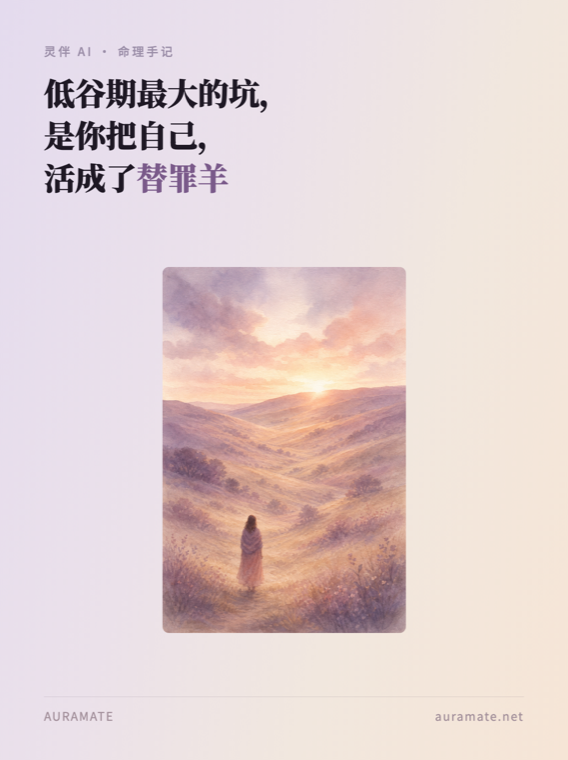

# auramate-text-image

AuraMate 灵伴（`auramate.net`）**小红书图文**生产手艺，打包成一组 Claude Code / Codex / OpenClaw 通用的 skill。

目标：**一个完全没有 context 的 agent，clone 这个仓库、装上 skill，就能独立选题 → 写文案 → 出图 → 过红线 → 交发布包**，产出质量和跑了半年的老 agent 一致。

这里的每一条规则都不是拍脑袋写的，是 2026-05 到 2026-08 之间在真账号上被拒稿、被限流、被用户打回来换出来的。

---

## 长什么样

下面全部是**跑出来的真图**（`docs/demo/`，源 HTML 就在旁边，`node render.js` 可复现）。

### 模板 A · 渐变编辑风 —— 定版主力，80% 的帖子用它

| 封面页 | 正文页 | 产品截图页 |
|---|---|---|
|  |  |  |
| 标题 132px 当主角 + 底部插图横带 | 正文统一 44px，一张写满 2–3 段 | 真实产品截图 + 52px 说明 + 数据标注 |

### 模板 B · 浅底卡片风 —— 图鉴自测、一张一个观点

| 封面页 | 内页 |
|---|---|
|  |  |
| 黑体 150px 超大字 + 圆形灵体 badge | 形态名 + 一句状态 + 真实灵体光球 |

### 模板 C · 深色压字风 —— 单张强冲击封面



> ⚠️ 这张 demo 截图里露出了「大运」「运势」，属灰区词。**真要发之前必须按 `01-redline.md` 复核截图里的字** —— 这正是最容易漏掉的一关。

---

## 封面改版记录（2026-08-10）

左边是改之前的线上模板，右边是现在的。**同样的文案、同样的插画，只改版式和配色。**

| 改之前 | 现在 |
|---|---|
|  |  |

**核心原则：标题是封面主角，插图是配角。**

改了五处：

1. **标题 68 → 132px，垂直居中占上半。** 封面的流量全靠标题，它得是第一眼看到的东西。字号按每行字数选：≤6 字 150 / 7–8 字 132 / 9–10 字 106 —— 超了会自动折行，把手动 `<br/>` 断行冲掉（148px 配 8 字实测就爆）。
2. **插图改成底部 400px（画面 24%）的横带**，出血到左右边缘。改之前 `max-width:540px` 只占一半宽度，两侧和上方全是大白，正好犯了自己定的「不留白」。
   > 中间还翻过一次车：先矫枉过正把插图铺满，结果图喧宾夺主。两版都记在 `02-visual-system.md` 里当反面教材。
3. **竖构图插画裁成横带会切掉主体** —— `object-position:center 76%` 把背影拉回画面。换插图要重调这个值。
4. **渐变加深 + 两角柔光** —— 改之前中间发灰，看着像渲染出来的带状色块，不像设计。
5. **accent 紫 `#7a5a8a` → `#6b3f8f`，加纸感颗粒。** 旧紫太灰，看不出「替罪羊」是刻意强调；颗粒用内联 `feTurbulence` SVG，自包含。

---

## 快速开始

```bash
git clone git@github.com:ChenJiangxi/auramate-text-image.git
cd auramate-text-image
./install.sh          # 软链到 ~/.claude/skills/，顺带检查 playwright / PIL / codex
```

装完在会话里说「做一篇 AuraMate 小红书图文」，`auramate-tuwen` 会被触发，它会把你路由到对应的子 skill。

不想装也行 —— 直接让 agent `Read skills/auramate-tuwen/SKILL.md` 起手。

### 出一篇的完整流程

```bash
tools/new-post.sh digu-kline editorial-gradient 6   # 建目录 + 铺模板 + content.md 骨架
# → 写文案进 content.md，填 slide-1..6.html，把素材放进 assets/
cd posts/post-digu-kline && node render.js          # 出 1242×1660 PNG
tools/redline-scan.sh posts/post-digu-kline/        # 违禁词扫描，命中即 exit 1
```

`redline-scan.sh` 长这样（对示例目录跑，它会红 —— 那是**未软化的原稿**，故意留着当教材）：

```
✗ 违禁词「八字」
    slide-3.html:16:  …所以我做了个东西，叫人生 K 线：拿你的八字，把你这一辈子的运势…
✗ 违禁词「命理」
    slide-1.html:13:  <div class="kicker">灵伴 AI · 命理手记</div>
⚠ 灰区词「运势」—— 看语境判断
────────────────────────────
命中 2 个违禁词 —— 不能发。替换表见 references/01-redline.md
```

---

## 三条不能破的底线

任何 agent 接手前先记这三条，其他都可以商量：

1. **只走 AI 科技向。** 玄学正面切入（算命 / 改运 / 风水 / 命理）在小红书和抖音都限流甚至封号。壳子必须是「AI 产品 / 工程师视角 / 古典文化数据集」。
2. **图里不能带信息。** 小红书图文里塞满 AI 输出文字、报告全文、营销话术 = 被判营销内容，开举报通道。图里只放视觉元素 + 你自己写的短句。
3. **灵体永远用产品真截图。** 不准 CSS 渐变球、不准 emoji、不准 mockup。这条比第 1 条还紧。

完整红线见 `skills/auramate-tuwen/references/01-redline.md`。

---

## 八个内容类型

子 skill 按**产出结构**分，不按题材 —— 结构一样的题材共用一个 skill。

| 类型 | 目的 | 频率 | 子 skill |
|---|---|---|---|
| **叙事随笔** ★ 主力 | 拉新 | 每周 2–3 | `tuwen-narrative-essay` |
| **知识解析** | 拉新 · 收藏 | 每周 1 | `tuwen-knowledge-decode` |
| **图鉴自测** | 互动 · 涨粉 | 每两周 1 | `tuwen-archetype-quiz` |
| **功能上新** | 转化 | 有就发 | `tuwen-feature-launch` |
| **数据背书** | 信任 | 每月 1 | `tuwen-proof-benchmark` |
| **抽奖活动** | 互动 | 每月 1 | `tuwen-campaign-giveaway` |
| **日签日更** | 留存 · 养号 | 每日 | `tuwen-daily-sign` |
| **节令热点** | 拉新 · 时效 | 跟日历 | `tuwen-seasonal` |

建议配比、选题库、十神对照表 → `skills/auramate-tuwen/references/07-content-matrix.md`

---

## 仓库结构

```
skills/
  auramate-tuwen/            主 skill · 总入口 · 铁律 · 路由表
    references/
      00-brand.md            品牌 / 受众 / 22 个玩法功能表（含真实 id）
      01-redline.md          违禁词 / 安全替换表 / 发布前 checklist
      02-visual-system.md    三套模板的完整色值字号页型
      03-copywriting.md      人味儿写作 / 标题公式 / 钩子→功能桥接法
      04-assets.md           素材在哪、取图优先级、benchmark 数据诚实红线
      05-toolchain.md        渲染 / codex 生图 / 裁图 / 本机踩过的坑
      06-publish.md          发布包格式 / 评论区 / 数据回收
      07-content-matrix.md   内容矩阵 / 配比 / 选题库 / 十神对照表
  tuwen-*/                   8 个子 skill，见上表
templates/
  editorial-gradient/        ★ 模板 A · cover / body / shot 三种页型
  card-light/                模板 B · cover / body
  screenshot-caption/        模板 C · cover
  render.js                  HTML → 1242×1660 PNG（Playwright）
tools/
  redline-scan.sh            违禁词扫描 · 发布前必跑 · 命中即 exit 1
  new-post.sh                起一个新 post 目录
docs/demo/                   上面那些图 + 源 HTML，可复现
examples/
  post-digu-kline/           一篇真实已发稿的六步拆解（WALKTHROUGH.md）
```

---

## 依赖

| 用途 | 依赖 | 没有的话 |
|---|---|---|
| HTML → PNG | `playwright` + chromium | 出不了图，必须装 |
| 中文字体 | Google Fonts（联网 `@import`） | 断网会 fallback 到 PingFang SC，渲完肉眼看一眼 |
| 裁图 | `/usr/bin/python3` + PIL | 用 macOS 原生 `sips` 代替 |
| AI 插画 | `codex` CLI（ChatGPT OAuth） | 配图改用真实产品截图 |

⚠️ 本机默认 `python3`（Homebrew 3.14）**是坏的** —— 没有 Pillow，`pyexpat` 符号对不上，`pip3 install` 也会崩。裁图一律用 `/usr/bin/python3` 或 `sips`。细节见 `05-toolchain.md`。

---

## 维护约定

- 每次被用户拒稿 / 平台限流，**当天**把结论写进对应的 reference，注明日期和原话。
- 模板改了要同步改 `templates/` 和 `docs/demo/`，别只在某一篇 post 里改。
- 新增内容类型 → 新开一个 `tuwen-*` 子 skill，别往主 skill 里堆。
