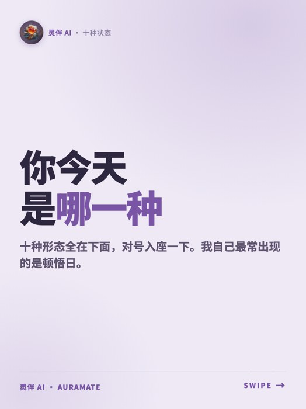
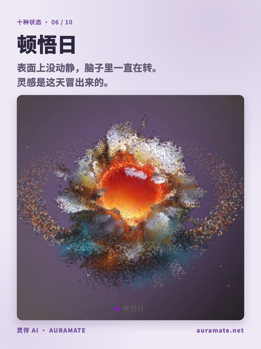
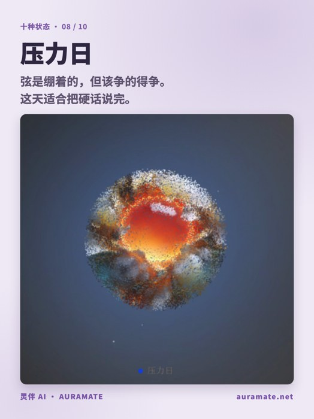
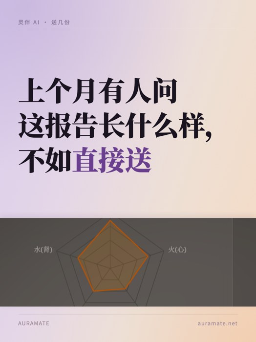
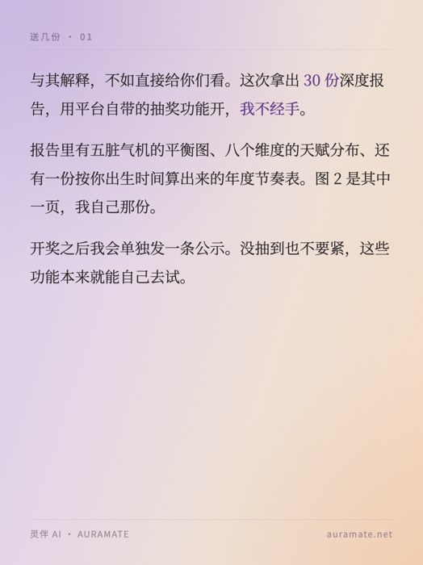

# auramate-text-image

AuraMate 灵伴（`auramate.net`）**小红书图文**生产手艺，打包成一组 Claude Code / Codex / OpenClaw 通用的 skill。

目标：**一个完全没有 context 的 agent，clone 这个仓库、装上 skill，就能独立选题 → 写文案 → 出图 → 过红线 → 交发布包**，产出质量和跑了半年的老 agent 一致。

这里的每一条规则都不是拍脑袋写的，是 2026-05 到 2026-08 之间在真账号上被拒稿、被限流、被用户打回来换出来的。

---

# 八个内容类型 · 每个都跑了 demo

下面每一套都是**真跑出来的图**，文案按对应子 skill 的规则写的，不是占位符。
源在 `docs/demo/`，`/usr/bin/python3 build.py && node render.js` 可复现。

---

## 1 · 心理钩子 reframe ★ 主力线

拿一个热门心理概念当钩子，桥到一个真实功能，落在哲思上。**日常 40–60% 的产能放这里。**
骨架：`痛点 → 缺的那个东西 → 功能正好给了它 → 哲思落点`

| 封面 | 痛点 | 产品图 |
|---|---|---|
|  |  |  |

> 钩子「高敏 + 带旧伤 + 野心家，低谷期只会向内求」→ 缺一把**尺子**（量不出这段难有几分是自己、几分是时运）→ 人生 K 线 `life-kline` 给出这个坐标 → 落点「命运不是免罪符，是坐标」。

skill：`tuwen-narrative-essay`

---

## 2 · 十神解析

玄学里唯一能科普化的体系，十个类型像 MBTI，收藏率最高、能做十期系列。
**难点：「十神」「伤官」「印」全是违禁词** —— 必须用产品官方的形态名（合作日 / 分享日 / 美食日 / 发疯日 / 搞钱日 / 捡漏日 / 卷王日 / 压力日 / 学习日 / 顿悟日）。

| 封面 | 讲结构 | 成对对比 |
|---|---|---|
|  |  |  |

> **真知识点 = 十种其实是五对**（并肩 / 往外给 / 拿到 / 管着 / 托着），每对是同一件事的
> 「正 · 稳」版和「偏 · 野」版。这层结构可复述、有信息量，一期讲一对能做五期系列。
>
> 十个原名里「伤官」「印」是违禁词，**一个都不写** —— 只用形态名 +「正 / 偏」这层结构讲，
> 「正」「偏」两个字本身不违禁。
>
> **这一节是返工过的。** 第一版写成「古人有一套东西叫十神，我把它做成了产品」，
> 用户一句「你觉得这是十神吗」就戳穿了：全篇没讲透任何概念，是伪装成知识贴的功能贴。
> 教训写进了 skill 的「什么才算解析」门槛。

skill：`tuwen-knowledge-decode`

---

## 3 · 图鉴自测 · 对号入座

互动率和涨粉最高的一类。成败只看一件事：**读者有没有想说「我是 X」的冲动。**

| 封面 | 形态 06 | 形态 08 |
|---|---|---|
|  |  |  |

> 形态名要有画面感 —— 「发疯日」「捡漏日」赢「伤官型」「偏财型」一万倍。
> ⚠️ 互动只能写**开放式陈述**（「你今天是哪一种」），**不能写**「评论区扣 1」「第一个留言送解读」—— 那是引导评论 redline。

skill：`tuwen-archetype-quiz`

---

## 4 · 功能更新

一个月最多 2 篇 —— 纯上新帖在小红书天然是广告，发多了压账号权重。
核心转化：**从「上线公告」改写成「我做了个东西」。**

| 封面 | 场景痛点 | 产品图 |
|---|---|---|
|  |  |  |

> **标题是痛点，不是功能名** —— 「在哪个城市我会过得松一点」而不是「旺运地图上线」。
> 全文没有「重磅 / 全新 / 立即体验 / 赋能」。底栏写数据标注（「越红越舒展」），不是广告语。

skill：`tuwen-feature-launch`

---

## 5 · BaziQA 数据集测评

把「又一个算命 app」和「认真做的 AI 产品」分开的唯一武器。一个月一篇。

| 封面 | 图表 | 口径说明 |
|---|---|---|
|  |  |  |

> **数据诚实红线**（skill 里写死了）：
> - 竞品必须用真实品牌 logo，不许「DS」「GPT」文字圆标
> - 「灵伴超过所有通用大模型」只在竞赛 xlsx 那 5 个模型口径下成立，**不能混 live 榜**
> - 灵伴 37.1% **没有赢过人类冠军 44.4%**，demo 第三张就是老老实实说这件事
> - 想加 Claude / Grok 必须先补测，不能臆造

skill：`tuwen-proof-benchmark`

---

## 6 · 使用教程

收藏率天花板，付费用户也看。

| 封面 | 第一步 | 怎么读 |
|---|---|---|
|  |  |  |

> 教程可以更工具化，但仍然**不能出现「教你算」「学会看盘」** —— 那是服务承诺式，触发 redline。
> 用「这份报告我看了三遍才看懂，整理了一下」。

skill：`tuwen-feature-launch`（教程型变体）

---

## 7 · 抽奖活动

⚠️ **高危账号期我不建议做** —— 抽奖是平台重点监控的营销行为，想激活评论区用图鉴自测能拿到一样的效果、零合规风险。真要做按下面来。

| 封面 | 说明 |
|---|---|
|  |  |

> 必须走**小红书官方抽奖组件**，正文只陈述「用平台的抽奖功能开，我不经手」。
> 绝不能写：评论区扣 1 / 关注点赞三连才有资格 / 私信领取 / 第一个留言送。
> 送积分前**先跟工程侧确认发放链路是通的** —— 产品出过 Stripe webhook 从未触发 grant 的系统级 bug，100+ 付费用户没拿到。中奖了拿不到东西比不做活动伤害更大。

skill：`tuwen-campaign-giveaway`

---

## 8 · 节令热点

节气是**公认的传统文化，不是玄学** —— 零红线、有流量、顺带带出功能。也是账号被限流后最好的洗白内容。

| 封面 | 产品图 | 落点 |
|---|---|---|
|  |  |  |

> **提前 3–7 天发**，当天发已经晚了 —— 用户在节点前找内容，节点当天在过节。
> 不写「宜 / 忌」（黄历格式直接踩线），写「适合 / 不太适合」。

skill：`tuwen-seasonal`

---

## 还有一类：日签日更

每日灵签，低成本养号。不追求爆，作用是保持活跃度、喂算法。单图日更 + 每周一次周合集。
skill：`tuwen-daily-sign`

---

# 红线扫描是真能拦住东西的

上面这 8 套 demo 我写完第一版跑扫描，**自己就踩了两处**：

```
✗ 违禁词「命理」
    08-jieling-2.html:32:<span>灵伴 AI · 命理体检</span>
    01-reframe-1.html:38:<div class="kicker">灵伴 AI · 命理手记</div>
```

「命理体检」是产品里真实的功能名，「命理手记」是之前真发过的栏目名 —— 两个都是违禁词。已改成「五脏读数」「状态手记」。

```bash
tools/redline-scan.sh docs/demo/       # 命中即 exit 1
```

图片里的字扫不到，那部分靠 `01-redline.md` 的人工 checklist。

---

# 快速开始

```bash
git clone git@github.com:ChenJiangxi/auramate-text-image.git
cd auramate-text-image
./install.sh          # 软链到 ~/.claude/skills/，顺带检查 playwright / PIL / codex
```

装完在会话里说「做一篇 AuraMate 小红书图文」，`auramate-tuwen` 会被触发，它会把你路由到对应的子 skill。
不想装也行 —— 直接让 agent `Read skills/auramate-tuwen/SKILL.md` 起手。

## 出一篇的完整流程

```bash
tools/new-post.sh digu-kline editorial-gradient 6   # 建目录 + 铺模板 + content.md 骨架
# → 写文案进 content.md，填 slide-1..6.html，素材放进 assets/
cd posts/post-digu-kline && node render.js          # 出 1242×1660 PNG
tools/redline-scan.sh posts/post-digu-kline/        # 违禁词扫描
```

---

# 三条不能破的底线

1. **只走 AI 科技向。** 玄学正面切入（算命 / 改运 / 风水 / 命理）在小红书和抖音都限流甚至封号。壳子必须是「AI 产品 / 工程师视角 / 古典文化数据集」。
2. **图里不能带信息。** 图文里塞满 AI 输出文字、报告全文、营销话术 = 被判营销内容，开举报通道。图里只放视觉元素 + 你自己写的短句。
3. **灵体永远用产品真截图。** 不准 CSS 渐变球、不准 emoji、不准 mockup。这条比第 1 条还紧。

完整红线见 `skills/auramate-tuwen/references/01-redline.md`。

---

# 仓库结构

```
skills/
  auramate-tuwen/            主 skill · 总入口 · 铁律 · 路由表
    references/
      00-brand.md            品牌 / 受众 / 22 个玩法功能表（含真实 id）
      01-redline.md          违禁词 / 安全替换表 / 发布前 checklist
      02-visual-system.md    三套模板的完整色值字号页型
      03-copywriting.md      人味儿写作 / 标题公式 / 钩子→功能桥接法
      04-assets.md           素材在哪、取图优先级、benchmark 数据诚实红线
      05-toolchain.md        渲染 / codex 生图 / 裁图 / 本机踩过的坑
      06-publish.md          发布包格式 / 评论区 / 数据回收
      07-content-matrix.md   内容矩阵 / 配比 / 选题库 / 十神对照表
  tuwen-*/                   8 个子 skill，见上面每一节
templates/
  editorial-gradient/        ★ 主力模板 · cover / body / shot 三种页型
  card-light/                卡片风（图鉴自测）· cover / body
  screenshot-caption/        深色压字风（单张冲击封面）
  render.js                  HTML → 1242×1660 PNG（Playwright）
tools/
  redline-scan.sh            违禁词扫描 · 发布前必跑
  new-post.sh                起一个新 post 目录
docs/demo/                   上面所有 demo 的源 + 图 + build.py
examples/
  post-digu-kline/           一篇真实已发稿的六步拆解（WALKTHROUGH.md）
```

---

# 依赖

| 用途 | 依赖 | 没有的话 |
|---|---|---|
| HTML → PNG | `playwright` + chromium | 出不了图，必须装 |
| 中文字体 | Google Fonts（联网 `@import`） | 断网会 fallback 到 PingFang SC，渲完肉眼看一眼 |
| 裁图 | `/usr/bin/python3` + PIL | 用 macOS 原生 `sips` 代替 |
| AI 插画 | `codex` CLI（ChatGPT OAuth） | 配图改用真实产品截图 |

⚠️ 本机默认 `python3`（Homebrew 3.14）**是坏的** —— 没有 Pillow，`pyexpat` 符号对不上，`pip3 install` 也会崩。裁图一律用 `/usr/bin/python3` 或 `sips`。

---

# 封面改版记录（2026-08-10）

**标题是封面主角，插图是配角。**

| 最初 | 现在 |
|---|---|
|  |  |

1. **标题 68 → 132px**，`flex:1` 垂直居中占上半。字号按每行字数选：≤6 字 150 / 7–8 字 132 / 9–10 字 106 —— 超了会自动折行，把手动 `<br/>` 断行冲掉（148px 配 8 字实测就爆）。
2. **插图退成底部 400px（画面 24%）横带**，出血到左右边缘。最初 `max-width:540px` 只占一半宽度，两侧和上方全是大白，犯了自己定的「不留白」；中间还矫枉过正把图铺满过一次，图喧宾夺主。两版都写进 `02-visual-system.md` 当反面教材。
3. **`object-position:center 76%`** —— 竖构图插画裁成横带会切掉主体，这个值把背影拉回画面。换插图要重调。
4. **渐变加深 + 两角柔光 + 纸感颗粒**，accent 紫 `#7a5a8a` → `#6b3f8f`。

---

# 维护约定

- 每次被用户拒稿 / 平台限流，**当天**把结论写进对应的 reference，注明日期和原话。
- 模板改了要同步跑 `docs/demo/build.py` 重出 demo，别只在某一篇 post 里改。
- 新增内容类型 → 新开一个 `tuwen-*` 子 skill，别往主 skill 里堆。
